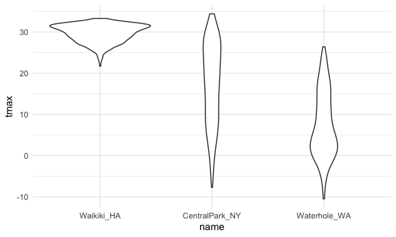
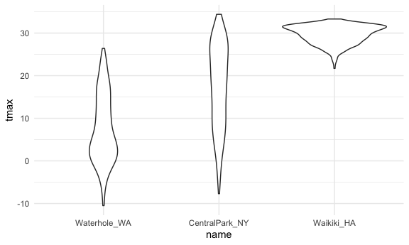
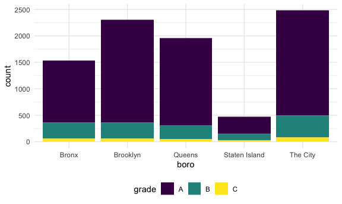
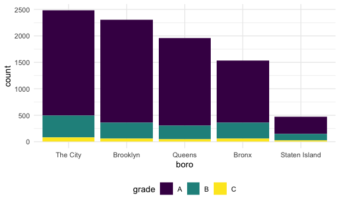

Strings and factors
================

rvest –data from the web

## Strings and regex

str\_detect –detect pattern –does this pattern appears anywhere in the
string–uppercase and lower case matters

``` r
string_vec = c("my", "name", "is", "jeff")


str_detect(string_vec, "jeff")
```

    ## [1] FALSE FALSE FALSE  TRUE

``` r
str_detect(string_vec, "JEFF")
```

    ## [1] FALSE FALSE FALSE FALSE

``` r
str_replace(string_vec,"jeff","Jeff")
```

    ## [1] "my"   "name" "is"   "Jeff"

^i think - in the beginning of the line i think$ - in the end of the
line

``` r
string_vec = c(
  "i think we all rule for participating",
  "i think i have been caught",
  "i think this will be quite fun actually",
  "it will be fun, i think"
  )
str_detect(string_vec, "i think")
```

    ## [1] TRUE TRUE TRUE TRUE

``` r
str_detect(string_vec, "^i think")
```

    ## [1]  TRUE  TRUE  TRUE FALSE

``` r
str_detect(string_vec, "i think$")
```

    ## [1] FALSE FALSE FALSE  TRUE

\[Bb\]ush –either capital b or lowcase b works

``` r
string_vec = c(
  "Y'all remember Pres. HW Bush?",
  "I saw a green bush",
  "BBQ and Bushwalking at Molonglo Gorge",
  "BUSH -- LIVE IN CONCERT!!"
  )
str_detect(string_vec,"bush")
```

    ## [1] FALSE  TRUE FALSE FALSE

``` r
str_detect(string_vec,"Bush")
```

    ## [1]  TRUE FALSE  TRUE FALSE

``` r
str_detect(string_vec,"[Bb]ush")
```

    ## [1]  TRUE  TRUE  TRUE FALSE

number first immediate follow by the letter [1]\[a-zA-Z\]—anything
between 0 and 9, nextone can be a-z or A-Z in the beginning of the line

``` r
string_vec = c(
  '7th inning stretch',
  '1st half soon to begin. Texas won the toss.',
  'she is 5 feet 4 inches tall',
  '3AM - cant sleep :('
  )

str_detect(string_vec, "^[0-9][a-zA-Z]")
```

    ## [1]  TRUE  TRUE FALSE  TRUE

. —- it is the special character to math any other thing 7.11 – will
also match 7:11, 7-11 (anything between 7 and 11 will match) 7\\.11 –
will only match 7.11

``` r
string_vec = c(
  'Its 7:11 in the evening',
  'want to go to 7-11?',
  'my flight is AA711',
  'NetBios: scanning ip 203.167.114.66'
  )
str_detect(string_vec, "7.11")
```

    ## [1]  TRUE  TRUE FALSE  TRUE

``` r
str_detect(string_vec, "7\\.11")
```

    ## [1] FALSE FALSE FALSE  TRUE

 is also special character. so we want to use \\.

``` r
string_vec = c(
  'The CI is [2, 5]',
  ':-]',
  ':-[',
  'I found the answer on pages [6-7]'
  )
str_detect(string_vec, "\\[")
```

    ## [1]  TRUE FALSE  TRUE  TRUE

## Factors

it will have levels in the output levels : female, male

``` r
factor_vec = factor(c("male", "male", "female", "female"))
factor_vec
```

    ## [1] male   male   female female
    ## Levels: female male

``` r
as.numeric(factor_vec)
```

    ## [1] 2 2 1 1

what happens if i relevel… fct\_relevel fct\_drop –drop the level from
the factor fct\_recode -change the label levels will change to levels :
male, female

``` r
factor_vec = fct_relevel(factor_vec,"male")
factor_vec
```

    ## [1] male   male   female female
    ## Levels: male female

``` r
as.numeric(factor_vec)
```

    ## [1] 1 1 2 2

## NSDUH–strings

``` r
nsduh_url = "http://samhda.s3-us-gov-west-1.amazonaws.com/s3fs-public/field-uploads/2k15StateFiles/NSDUHsaeShortTermCHG2015.htm"
table_marj = 
  read_html(nsduh_url) %>% 
  html_nodes(css = "table") %>% 
  first() %>%
  html_table() %>% 
  slice(-1) %>% 
  as_tibble()
```

-   State: pivot anything that is no state -str\_replace(var,old,new)
    -filter i dont want my state variable in “Total U.S.”, “Northeast”,
    “Midwest”, “South”, “West”

``` r
data_marj = 
  table_marj %>%
  select(-contains("P Value")) %>%
  pivot_longer(
    -State,
    names_to = "age_year", 
    values_to = "percent") %>%
  separate(age_year, into = c("age", "year"), sep = "\\(") %>%
  mutate(
    year = str_replace(year, "\\)", ""),
    percent = str_replace(percent, "[a-c]$", ""),
    percent = as.numeric(percent)) %>%
  filter(!(State %in% c("Total U.S.", "Northeast", "Midwest", "South", "West")))
```

# NSDUH — factors

rotate the x variable name – theme(axis.text.x = element\_text(angle =
90, hjust = 1))

``` r
data_marj %>%
  filter(age == "12-17") %>% 
  mutate(State = fct_reorder(State, percent)) %>% 
  ggplot(aes(x = State, y = percent, color = year)) + 
  geom_point() +
    theme(axis.text.x = element_text(angle = 90, hjust = 1))
```


## Weather data

``` r
weather_df = 
  rnoaa::meteo_pull_monitors(
    c("USW00094728", "USC00519397", "USS0023B17S"),
    var = c("PRCP", "TMIN", "TMAX"), 
    date_min = "2017-01-01",
    date_max = "2017-12-31") %>%
  mutate(
    name = recode(
      id, 
      USW00094728 = "CentralPark_NY", 
      USC00519397 = "Waikiki_HA",
      USS0023B17S = "Waterhole_WA"),
    tmin = tmin / 10,
    tmax = tmax / 10) %>%
  select(name, id, everything())
```

    ## Registered S3 method overwritten by 'hoardr':
    ##   method           from
    ##   print.cache_info httr

    ## using cached file: ~/Library/Caches/R/noaa_ghcnd/USW00094728.dly

    ## date created (size, mb): 2021-10-17 19:22:04 (7.605)

    ## file min/max dates: 1869-01-01 / 2021-10-31

    ## using cached file: ~/Library/Caches/R/noaa_ghcnd/USC00519397.dly

    ## date created (size, mb): 2021-10-17 19:22:09 (1.697)

    ## file min/max dates: 1965-01-01 / 2020-02-29

    ## using cached file: ~/Library/Caches/R/noaa_ghcnd/USS0023B17S.dly

    ## date created (size, mb): 2021-10-17 19:22:12 (0.912)

    ## file min/max dates: 1999-09-01 / 2021-10-31

let Waikiki\_HA becomes the first order in my data set

``` r
weather_df %>% 
  mutate(name = fct_relevel(name,"Waikiki_HA")) %>% 
  ggplot(aes(x=name,y=tmax))+
  geom_violin()
```

    ## Warning: Removed 3 rows containing non-finite values (stat_ydensity).


name in order according to the tmax

``` r
weather_df %>% 
  mutate(name = fct_reorder(name,tmax)) %>% 
  ggplot(aes(x=name,y=tmax))+
  geom_violin()
```

    ## Warning: Removed 3 rows containing non-finite values (stat_ydensity).



linear regression

``` r
weather_df %>% 
  lm(tmax~name,data=.)
```

    ## 
    ## Call:
    ## lm(formula = tmax ~ name, data = .)
    ## 
    ## Coefficients:
    ##      (Intercept)    nameWaikiki_HA  nameWaterhole_WA  
    ##           17.366            12.291            -9.884

## Restaurant Inspections

``` r
data("rest_inspec")
rest_inspec %>% 
  janitor::tabyl(boro,grade)
```

    ##           boro     A     B    C Not Yet Graded   P    Z   NA_
    ##          BRONX 13688  2801  701            200 163  351 16833
    ##       BROOKLYN 37449  6651 1684            702 416  977 51930
    ##      MANHATTAN 61608 10532 2689            765 508 1237 80615
    ##        Missing     4     0    0              0   0    0    13
    ##         QUEENS 35952  6492 1593            604 331  913 45816
    ##  STATEN ISLAND  5215   933  207             85  47  149  6730

str\_to\_title –change MANHATTAN to Manhattan

``` r
rest_inspec =rest_inspec %>% 
  filter(str_detect(grade,"[ABC]"),
   boro != "Missing") %>% 
  mutate(boro = str_to_title(boro))
```

``` r
rest_inspec %>% 
  filter(str_detect(dba,"[Pp][Ii][Zz][Zz][Aa]")) %>% 
  janitor::tabyl(boro,grade)
```

    ##           boro    A   B  C
    ##          Bronx 1170 305 56
    ##       Brooklyn 1948 296 61
    ##      Manhattan 1983 420 76
    ##         Queens 1647 259 48
    ##  Staten Island  323 127 21

fill=grade,sperate by the grade fct\_infreq –change in the frequency you
see the thing

``` r
rest_inspec %>% 
  filter(str_detect(dba,"[Pp][Ii][Zz][Zz][Aa]")) %>% 
  mutate(
    boro = fct_infreq(boro)) %>% 
  ggplot(aes(boro,fill=grade))+geom_bar()
```


this does not work to rearrange the frequency because you first put the
data into factor and then change into the string

``` r
rest_inspec %>% 
  filter(str_detect(dba,"[Pp][Ii][Zz][Zz][Aa]")) %>% 
  mutate(
    boro = fct_infreq(boro),
    boro = str_replace(boro,"Manhattan","The City")) %>% 
  ggplot(aes(boro,fill=grade))+geom_bar()
```



``` r
rest_inspec %>% 
  filter(str_detect(dba,"[Pp][Ii][Zz][Zz][Aa]")) %>% 
  mutate(
    boro = fct_infreq(boro),
    boro = fct_recode(boro,"The City"= "Manhattan")) %>% 
  ggplot(aes(boro,fill=grade))+geom_bar()
```



[1] 0-9
